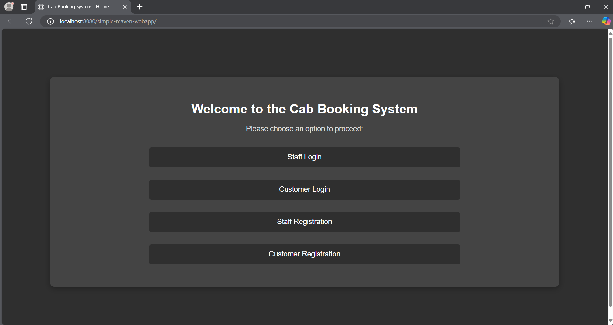

# cab-service

## Project Overview
Cab Service is a web-based application designed to streamline the operations of a popular cab service in Colombo City. The application facilitates customer bookings, billing calculations, and provides a platform for managing vehicles and drivers. The system uses a 3-tier architecture with MVC (Model-View-Controller) and various design patterns to ensure modularity and scalability.

## Technologies Used

- **Programming Languages**:  
  - Java (JSP, Servlets)
  - HTML, CSS, JavaScript (Frontend)
  - SQL (MySQL for database management)

- **Frameworks & Tools**:  
  - **Maven** (Dependency management)
  - **NetBeans** (IDE for development)
  - **JSP** (Java Server Pages for the frontend)
  - **Servlets** (Backend processing)
  - **MySQL** (Database management)
  - **Git & GitHub** (Version control)
  - **Apache Tomcat** (Servlet container)
  - **JDBC** (Database connectivity)
  
- **Design Patterns Used**:
  - **MVC (Model-View-Controller)**: To separate the concerns of the system into distinct layers.
  - **Factory Pattern**: Used to create instances of different components (e.g., for handling pricing strategies).
  - **Singleton Pattern**: For creating a single instance of the database connection.
  - **Observer Pattern**: Used for customer notifications like booking confirmations.
  - **Facade Pattern**: To provide a simplified interface for complex subsystems (e.g., booking system).

## Features

- **Authentication**: Login using username and password.
- **Customer Booking Management**: Add new bookings, view booking details, and calculate the bill.
- **Vehicle and location Management**: Admins can add vehicle and location details.
- **Billing System**: Automatically calculates the fare based on distance, vehicle type, and additional services.


## Screenshots


## Database Structure

The system uses a MySQL database (`megacitycabdb`) with the following tables:

- **Customer Table**: Stores customer details like registration number, name, and contact information.
- **Staff Table**: Stores staff details like registration number, name, and contact information.
- **Booking Table**: Contains details about each booking, including the customer, vehicle, and price.
- **Vehicle Table**: Stores information about available vehicles.
- **Location Table**: Keeps track of locations and their associated distances and prices.

## How to Deploy

### Prerequisites:
- Java Development Kit (JDK) 8 or higher.
- Apache Tomcat server (or any servlet container).
- MySQL server with the `megacitycabdb` database.

### Steps to Deploy:

1. **Clone the Repository**:
    ```sh
    git clone https://github.com/your-username/CabServiceWebApp.git
    ```
1. Open **NetBeans**.
2. Go to **File > Open Project** and select the cloned project directory.
3. Install **MySQL** and create the `megacitycabdb` database.
4. Create the necessary tables (`customer`, `booking`, `vehicle`, `location`, `staff`) based on the project structure.
5. Update the database connection details in `dbConfig.properties` or the relevant configuration file.
6. Right-click on the project in **NetBeans** and select **Run**.
7. This will deploy the web application on the embedded **Tomcat** server.
8. Open a browser and navigate to:  

## License

This project is open-source and available under the **MIT License**.  
See the [LICENSE](LICENSE) file for more details.
